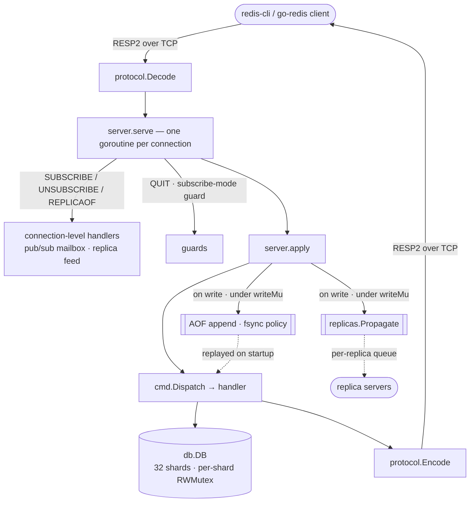
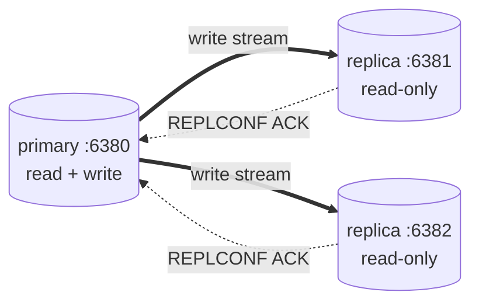

# mini-redis-go

<!-- Grafana: replace YOUR_GRAFANA_URL once the public dashboard is shared (Day 3). -->
[](https://github.com/ThatDeparted2061/mini-redis-go/actions/workflows/chaos.yml)
[](https://stats.uptimerobot.com/bOsSHg8LFd)
[](https://stats.uptimerobot.com/bOsSHg8LFd)
[](https://discord.gg/bhpZug8pQT)

📊 **Live metrics dashboard:** [Grafana (public, read-only)](https://YOUR_GRAFANA_URL) — ops/sec by command, p50/p99 latency, AOF fsync latency, replication lag, memory, connections. Fed by the Prometheus `/metrics` endpoint (see [docs/CAPACITY.md](deploy/docs/CAPACITY.md) and `deploy/docker-compose.yml`).

A small, from-scratch Redis-compatible server in Go. It speaks the real Redis
wire protocol (RESP2), so standard clients — `redis-cli` and
`github.com/redis/go-redis/v9` — talk to it unmodified, backed by our own
in-memory key/value store.

Feature-wise it is a working single-node Redis: a sharded typed keyspace
(strings, lists, hashes, sets), key expiry with lazy **and** active eviction,
append-only-file persistence with compaction and a configurable fsync policy,
pub/sub, and primary/replica live replication with read-only replicas and a
heartbeat.

This is a learning project built in phases. It is intentionally simple where
production Redis is complex (a single write lock, a single-format AOF, no
cluster mode), and it **calls those simplifications out** rather than hiding
them — see [Known limitations](#known-limitations).

## Documentation

- [Architecture (HLD)](deploy/docs/ARCHITECTURE.md) — components, request-lifecycle
  sequence diagrams, consistency/durability model, failure modes.
- [Low-level design (LLD)](deploy/docs/LLD.md) — module tree, state machines,
  concurrency model, memory layout.
- [Capacity model](deploy/docs/CAPACITY.md) — measured throughput, network/memory
  ceilings, fleet sizing, bottleneck progression, cost projection.
- [Runbook](deploy/RUNBOOK.md) — deploy, update, rollback, disaster recovery,
  routine ops, incident log.

## Quick start

```bash
go run ./cmd/server --port 6380                       # start a primary
redis-cli -p 6380                                     # connect a real client

# start a read-only replica of that primary
go run ./cmd/server --port 6381 --appendonly=false \
  --replicaof "127.0.0.1 6380"

go test ./...                                         # run everything
go test -race ./...                                   # run with the race detector
```

## Demo

A scripted end-to-end run — the primary starting, `redis-cli` issuing a few
commands, a replica attaching, and a primary write appearing on the replica — is
recorded in [`demo/demo.cast`](demo/demo.cast):

```bash
asciinema play demo/demo.cast      # replay the recording
bash demo/demo.sh                  # …or run it live
```

## Commands supported

| Type     | Commands                                                        |
| -------- | --------------------------------------------------------------- |
| Generic  | `PING` `ECHO` `DEL` `EXISTS`                                     |
| String   | `SET` `GET`                                                     |
| List     | `LPUSH` `RPUSH` `LPOP` `RPOP` `LRANGE` `LLEN`                   |
| Hash     | `HSET` `HGET` `HDEL` `HGETALL` `HKEYS` `HVALS` `HLEN`           |
| Set      | `SADD` `SREM` `SISMEMBER` `SMEMBERS` `SCARD`                    |
| Expiry   | `EXPIRE` `PEXPIRE` `TTL` `PTTL` `PERSIST`                       |
| Pub/Sub  | `SUBSCRIBE` `UNSUBSCRIBE` `PUBLISH`                             |

A key holds exactly one type; using a command on the wrong type returns the
canonical `WRONGTYPE` error, just like Redis.

## Configuration

All configuration is via command-line flags (`go run ./cmd/server --help`):

| Flag            | Default          | Meaning                                                        |
| --------------- | ---------------- | -------------------------------------------------------------- |
| `--port`        | `6380`           | TCP port to listen on.                                         |
| `--appendonly`  | `true`           | Enable AOF persistence (log every write, replay on restart).   |
| `--aof-path`    | `appendonly.aof` | Path to the append-only file.                                  |
| `--appendfsync` | `everysec`       | fsync policy: `always`, `everysec`, or `no` (see below).       |
| `--replicaof`   | *(off)*          | `"host port"` — run as a read-only replica of that primary.    |

## Architecture

One client command flows through the layers below, each oblivious to the others.
Handlers never touch the socket or the RESP wire format; they receive decoded
arguments and return a `protocol.Value`.



There is exactly one shared `db.DB` for the whole process; its keyspace is
**sharded** into 32 maps, each under its own `RWMutex`, with a key routed to a
shard by `FNV-1a(key) % 32` — so operations on keys in different shards take
different locks and run in parallel. The server adds a single `writeMu` of its
own, taken on the write path **only** when the AOF or a replica is attached, so a
command's store mutation, its AOF append, and its replica propagation happen as a
unit and the one ordered log/stream matches the order the store applied writes.
Reads never take it; with persistence and replication both off, neither do
writes — they parallelize freely across shards.

`SUBSCRIBE`/`UNSUBSCRIBE` and `REPLICAOF` are the exceptions to "handlers never
touch the socket": they act on the *connection* (register a mailbox, turn the
socket into a replica feed), so `server.serve` handles them directly instead of
routing through `cmd.Dispatch`.

## Persistence semantics (AOF)

Writes are made durable with an **append-only file (AOF)**: the server logs the
*command* it just ran (e.g. `SET k v`), in the exact RESP bytes the client sent,
and on restart replays that log through the normal dispatcher to rebuild state.
Persistence is on by default (`--appendonly`, log at `--aof-path`).

**Startup replay.** On boot, before accepting any client, the server re-reads the
log with the *same* RESP decoder used on live connections and re-executes each
command against the empty store — so recovered state is correct by construction,
not by a separate loader. No new appends happen during replay (the log is opened
for writing only *after* recovery finishes), so nothing is duplicated. Recovery
is fast: replaying **1,000,000 distinct-key writes takes ~0.95 s (~1.0 million
commands/sec)** on an Apple M4, decode + dispatch into a fresh store. The server
logs the figure each boot, e.g. `aof: recovered 1000000 command(s) from
appendonly.aof in 991ms (1008654 cmd/s)`. Reproduce with
`go test ./internal/persistence/ -run='^$' -bench=BenchmarkReplay`.

The interesting knob is **when the log reaches the physical disk**. Writing bytes
with `write()` only hands them to the operating system's page cache; they survive
a crash of *our process* (`kill -9`) because the kernel still owns them, but a
**power loss** drops anything the kernel hasn't flushed yet. `fsync()` forces the
page cache to the disk platter/SSD — and it is slow (~1 ms on an SSD), so *how
often* we call it is the canonical durability-vs-throughput trade-off. The
`--appendfsync` flag picks the policy:

| Mode               | When it fsyncs              | Crash can lose     | Speed                       |
| ------------------ | --------------------------- | ------------------ | --------------------------- |
| `always`           | after every command         | at most 1 command  | slowest (~1 ms disk/write)  |
| `everysec` (default) | once a second, in the background | up to ~1 s of writes | fast (write path never waits on disk) |
| `no`               | never (OS flushes on its own, ~30 s) | up to ~30 s of writes | fastest, riskiest    |

- **`always`** fsyncs inline in the write path, so once a client gets its reply
  the command is on disk. Safest, but every write pays the sync.
- **`everysec`** is the sweet spot most deployments want (and Redis's default): a
  background `time.Ticker` fsyncs once a second while the write path only ever
  does the cheap `write()`. A crash loses at most the last second.
- **`no`** never explicitly fsyncs; durability is entirely at the OS's mercy.
  Fastest, but a power loss can roll you back tens of seconds.

A **clean shutdown is not a crash**: in every mode the log is fsync'd on graceful
stop, so a normal `Ctrl-C` loses nothing — the mode only governs what an abrupt
power loss costs.

### Compaction (AOF rewrite)

The log grows with every write, so a key written a million times leaves a million
frames. **Compaction** replaces that history with a *snapshot*: `db.Snapshot`
hands out a deep copy of every live key, and the rewriter emits one
value-restoring command per key (`SET`/`RPUSH`/`HSET`/`SADD`, plus a `PEXPIRE`
for any TTL), writes them to `appendonly.aof.tmp`, and `os.Rename`s it over the
live log (atomic on POSIX). A background goroutine triggers a rewrite once the log
passes a 64 KiB floor **and** has doubled since the last rewrite (mirroring
Redis's `auto-aof-rewrite-percentage`). v1 holds `writeMu` for the whole rewrite —
writes pause so nothing slips into the gap between snapshot and swap; Redis avoids
the pause with a fork/copy-on-write child (the documented upgrade path).

## Replication topology

One **primary** accepts writes; any number of **replicas** mirror it. Point a
replica at a primary with `--replicaof "host port"`:



**How a write reaches a replica.** On the primary, every successful write is
serialized once and pushed — non-blocking — into each replica's buffered queue
(`chan []byte`, cap 256), under the same `writeMu` as the AOF append, so replicas
receive writes in the exact order the store applied them with no socket I/O on the
write path. A per-replica goroutine drains the queue to that replica's socket. A
queue that overflows is **dropped-and-logged** (same policy as a slow pub/sub
subscriber).

**Handshake.** A replica dials the primary, sends a one-shot `REPLICAOF`
handshake, gets `+OK`, then decodes the live command stream and re-dispatches each
frame through the normal `cmd.Dispatch` path — so the primary's writes land in the
replica's own store. It retries every second until it connects.

**Read-only.** A replica **rejects** writes from ordinary clients with
`-READONLY You can't write against a read only replica.` while serving reads
normally (eventually consistent with the primary).

**Heartbeat.** The primary `PING`s every replica every 5 s; each replica answers
`REPLCONF ACK`; the primary records the ack time and logs a warning for any
replica silent for more than 30 s.

**No initial sync (v1).** A replica only mirrors writes made *after* it connects —
pre-existing keys are **not** transferred, and a restarted replica comes up empty.
See [Known limitations](#known-limitations).

## Key expiry (TTL)

Expiry is one of the more interesting parts of the design, because making keys
disappear "on time" without a single authoritative clock forces some real
trade-offs. mini-redis-go mirrors Redis and runs **two complementary eviction
strategies**.

### Data model

Each value is an `Entry` carrying a type tag and an `expireAt time.Time`. The
**zero value means "no expiry"** (the key is persistent), so a key with no TTL
costs no extra branches and no extra memory beyond the zero `Time`. Storing the
deadline inline on the entry is simpler than Redis's separate "expires"
dictionary; the cost shows up in active sampling (below).

A key is expired when `now >= expireAt`. That predicate (`Entry.expired`) is the
single source of truth; every read and write consults it.

### Why two strategies?

- **Lazy (passive) expiry** checks a key *when it is accessed* and deletes it if
  it has expired. It is essentially free — you were already looking the key up —
  but on its own it **leaks memory**: a key that is set with a TTL and then never
  touched again is never noticed, so it lives forever.
- **Active expiry** is a background loop that periodically samples the keyspace
  and evicts expired keys *even if no client touches them*. It bounds the leak
  that lazy expiry alone would allow.

Neither is sufficient alone; together they keep both the wire view and memory
correct. Redis makes the same choice for the same reason.

### Lazy expiry, and the lock-escalation problem

The subtle part: deleting a key is a **write**, but `GET` is a **read** and
deliberately takes only the read lock so many `GET`s run in parallel. If `GET`
discovers an expired key it cannot delete it while holding the read lock.

`GET` resolves this by **escalating** only on the (rare) expired path: it drops
the read lock and calls `expireIfNeeded`, which takes the write lock and
**re-checks** expiry before deleting. The re-check matters — between releasing
the read lock and acquiring the write lock another client may have `SET` the key
fresh or `PERSIST`ed it, and we must not delete a key that is no longer expired.
The common, non-expired path never escalates and stays fully concurrent.

All other lookups funnel through one of two helpers, so expiry is honored
uniformly instead of being re-implemented per command:

- **`peek`** (read side): returns a live entry or reports an expired key as
  absent, *without* deleting it. It runs under the caller's read lock, so it
  can't reclaim memory; that is left to `GET`, the write paths, and the active
  reaper. This keeps the typed read commands (`LLEN`, `HGET`, `SCARD`, …) on the
  cheap read lock.
- **`liveEntry`** (write side): returns a live entry or deletes an expired one,
  under the write lock. This is also what makes a write to an expired key
  **resurrect** it as fresh data — e.g. `RPUSH` onto an expired list starts a new
  list rather than appending to about-to-die contents.

### Active expiry, and the adaptive heuristic

`RunActiveExpiry(ctx)` runs for the server's lifetime and stops when the context
is cancelled. Every **100 ms** it runs a sampling *pass*: inspect up to **20**
keys that carry a TTL, delete the expired ones, and compute the expired fraction
of the sample. If **more than 25%** were expired, the keyspace is probably full of
dead keys, so it immediately runs another pass instead of waiting for the next
tick — Redis's own adaptive heuristic ("if it's dirty, drain harder"). This
terminates: each hot pass deletes the expired keys it sampled, so the population
of expired keys strictly shrinks. Samples are drawn from a random shard so none is
starved.

### Trade-offs vs. real Redis (the honest part)

- **Inline `expireAt` vs. an expires dict.** Storing the deadline on the entry is
  simple, but it means active sampling has to *scan past* persistent keys to find
  TTL-bearing ones. Redis keeps a dedicated dictionary of keys-with-expiry and
  samples directly from it. Fixable later by maintaining a parallel index.
- **Read commands report-absent but don't delete.** Only `GET` does synchronous
  lazy deletion; other reads honor expiry for their *result* and defer
  reclamation to the active cycle and write paths, to avoid escalating a read lock
  to a write lock on every typed read. The external behavior is identical; only
  memory-reclamation timing differs, bounded by the 100 ms active cycle.
- **Map-iteration sampling isn't uniformly random.** Go randomizes the *start* of
  iteration, which is good enough here but is not the uniform random sampling
  Redis does from its expires dict.

## Pub/Sub and the slow-subscriber problem

`SUBSCRIBE`/`PUBLISH` are a message bus, not storage: a published message is
fanned out to whoever is listening *right now* and is never saved. The broker is
a `map[channel] -> []subscriber`; each subscribed connection owns a buffered Go
channel (its "mailbox", cap 256) and a goroutine that drains the mailbox to the
socket. `PUBLISH` drops the message into every subscriber's mailbox.

A subscribed connection enters a **restricted mode** — only
`SUBSCRIBE`/`UNSUBSCRIBE`/`PING`/`QUIT` are accepted — because the connection has
become a one-way stream of pushed messages.

**The slow-subscriber problem** is the interesting part. A publisher can produce
faster than a subscriber consumes (a slow client, a saturated network). Messages
pile up in that subscriber's mailbox. Something has to give, and there are only
three options:

1. **Block the publisher** until the slow subscriber catches up. Fatal: `PUBLISH`
   runs on the *publisher's* goroutine, so one slow consumer would freeze the
   client that published — and every other subscriber waiting behind it.
2. **Drop the message** for the slow subscriber and move on. The publisher stays
   fast; the slow subscriber simply misses messages. Memory stays bounded.
3. **Disconnect the slow subscriber.** What real Redis does once a subscriber
   overruns its output-buffer limit — bounded memory, and the client gets a clear
   signal (a dropped connection) rather than silent gaps.

This server takes option **2** for v1: the send is non-blocking
(`select { case mailbox <- msg: default: /* drop + log */ }`), so a full mailbox
means the message is dropped with a logged warning, never a stall. It's the
simplest choice that keeps the publisher fast and memory bounded; option 3 is the
upgrade path.

## Benchmarks vs. real Redis

Honest numbers — an interviewer will re-run them. Measured on an **Apple M4 (10
cores)** against **real Redis 8.8.0**, both servers configured identically (AOF
on, `--appendfsync everysec`, no RDB snapshots). Always benchmark a compiled
binary, never `go run`, which folds in compile time:

```bash
go build -o bin/mini-redis ./cmd/server
./bin/mini-redis --port 6380 --appendfsync everysec
redis-server    --port 6379 --appendonly yes --appendfsync everysec --save ""
redis-benchmark -p 6380 -t set,get,lpush,hset -n 100000 -c 50 -q   # then -p 6379
```

| Command | mini-redis | Redis 8.8.0 | ratio |
| ------- | ---------: | ----------: | ----: |
| SET     |     76,453 |     134,953 |  57 % |
| GET     |    103,734 |     133,869 |  77 % |
| HSET    |     71,023 |     124,688 |  57 % |
| LPUSH   |      3,084 |     123,762 | 2.5 % |

SET/GET come in at **57 % / 77 %** of real Redis — in and above the realistic
50–70 % target — and HSET matches SET at 57 %. **LPUSH at 2.5 % is a real cliff,
and it is worth understanding rather than hiding.**

`redis-benchmark`'s built-in LPUSH test pushes to a *single fixed key* `mylist`
100,000 times. Our list is a Go slice with the head at index 0, so every `LPUSH`
prepends by allocating a new backing array and copying every existing element —
O(n) per push, O(n²) over the run, with per-op latency climbing from ~1 ms to
~30 ms as the one list grows to 100k elements. Redis uses a *quicklist* (a linked
list of small arrays), so its head insert is O(1). Point LPUSH at *many short*
lists instead of one giant one and the cliff disappears:

```bash
redis-benchmark -p 6380 -n 100000 -c 50 -r 100000 lpush list:__rand_int__ payload
```

| LPUSH target       | mini-redis | Redis 8.8.0 | ratio |
| ------------------ | ---------: | ----------: | ----: |
| one 100k-elem list |      3,084 |     123,762 | 2.5 % |
| 100k short lists   |     73,421 |     137,363 |  53 % |

At 53 % on short lists, LPUSH is back in line with SET/HSET — so dispatch, the
store, and the protocol are all fine; the O(n) slice head-insert is the single
real weakness, and swapping the slice for a linked-list backing is a
[known limitation](#known-limitations).

One caveat, so the numbers aren't oversold: with AOF on, every write serializes
through the server's one `writeMu`, and `redis-benchmark`'s reads don't contend
on a read lock — so this workload does not exercise the sharded keyspace's
parallelism. That pays off under many concurrent writers to *different* keys with
AOF off; here it is idle. Redis runs commands single-threaded, so per-instance
throughput is an apples-to-apples comparison.

## Known limitations

These are deliberate v1 scope cuts, not bugs — each is listed with what it would
take to close. Honesty here is the point: the gaps are as instructive as the code.

- **Sorted sets** (`ZADD`, `ZRANGE`, `ZSCORE`, …) — not implemented. Doing them
  right needs a skip list or balanced tree for O(log n) score-ordered inserts and
  range queries; the plain map/slice backings the other types use can't provide
  it.
- **Cluster mode** — single node only. There is no hash-slot routing across
  servers, no `CLUSTER`/`MOVED`/`ASK`, no gossip. The 32-way sharding here is
  *inside one process* (to cut lock contention), not a multi-node cluster.
- **Full RDB bootstrap / initial sync** — a freshly connected replica does **not**
  receive the primary's existing keys; it only mirrors writes made *after* it
  connects (the Day-17 no-snapshot contract). There is no RDB file format either.
  The upgrade path is a snapshot streamed as synthetic restore commands before the
  live feed.
- **Lua scripting** (`EVAL`, `EVALSHA`, `SCRIPT`) — not implemented.
- **Transactions** (`MULTI` / `EXEC` / `WATCH`) — not implemented.
- **Pub/Sub pattern matching** (`PSUBSCRIBE`) — not implemented; and a slow
  subscriber is **dropped-and-logged**, not disconnected (see above).
- **Slow replicas are dropped-and-logged**, not disconnected. Combined with no
  bootstrap, a slow replica can silently drift and needs a restart to resync;
  real Redis disconnects so the replica reconnects and re-syncs.
- **AOF rewrite pauses writes** — compaction holds `writeMu` for its whole
  duration rather than forking a copy-on-write child like Redis, so writes stall
  briefly during a rewrite.
- **The list backing is a slice**, so single-key `LPUSH` is O(n) (see
  [Benchmarks](#benchmarks-vs-real-redis)); a quicklist-style linked list of
  chunks would make head inserts O(1).
- **Metrics** (`internal/metrics`) and the `deploy/` production manifests are
  scaffolded but not wired to the running server.

## License

[MIT](LICENSE) © 2026 Harsh Rao.
