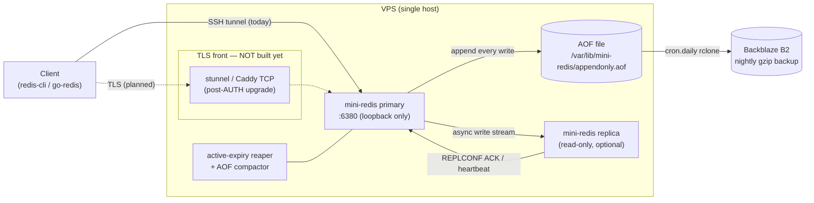
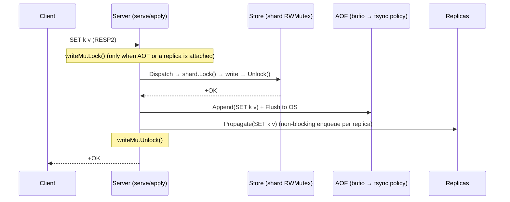

# mini-redis-go — Architecture (HLD)

High-level design. For the module-by-module view (state machines, concurrency)
see `LLD.md`; for the quantitative sizing see `CAPACITY.md`; for operating it see
`../RUNBOOK.md`. Diagrams are Mermaid — GitHub renders them inline.

---

## 1. Overview & goals

**Problem.** Provide a Redis-compatible key/value server, from scratch in Go, that
speaks the real RESP2 wire protocol so unmodified clients (`redis-cli`,
`go-redis/v9`) talk to it, backed by our own in-memory store — with durability
(AOF) and horizontal read-scaling (primary/replica) good enough to reason about
in a real deployment.

**In scope (built).**
- RESP2 protocol; strings, lists, hashes, sets; key expiry (lazy + active).
- Sharded in-memory store (32 shards, per-shard `RWMutex`).
- AOF persistence with compaction and a configurable fsync policy.
- Pub/Sub. Primary/replica live streaming with read-only replicas + heartbeat.
- Single static binary; Docker + systemd deploy; nightly off-site AOF backup.

**Non-goals (deliberately out of scope).**
- **No `AUTH`/ACL and no built-in TLS.** The port is loopback-only; reach it over
  an SSH tunnel. A TLS terminator (stunnel) is the documented upgrade *after*
  `AUTH` — see §2.
- **No auto-failover / cluster.** One primary; promotion is manual. No Sentinel,
  no gossip, no sharding *across* nodes (the 32 shards are in-process only).
- **No `maxmemory` eviction.** Only TTL expiry frees memory (see §5, OOM).
- **No synchronous replication / `WAIT`.** Replication is async only (§4).
- **No sorted sets** (needs an ordered structure; see project notes).
- **No snapshot bootstrap for replicas** — a replica mirrors only writes made
  *after* it connects.

---

## 2. System diagram

Solid = implemented today. Dashed = documented upgrade path, **not yet built**.



Today's real path is the **SSH tunnel**: the daemon binds `127.0.0.1:6380`, so
nothing is exposed publicly. The dashed TLS box is the intended edge once `AUTH`
lands (TLS encrypts the channel; it does not authenticate the caller, so it is
pointless without `AUTH` first).

---

## 3. Request lifecycle — sequence diagrams

### 3a. `SET` on a primary (durable write)

The mutation, the AOF append, and replica propagation happen as a unit under one
`writeMu`, so the log's order matches the store's.



`fsync` timing is the `--appendfsync` policy: `always` (per write), `everysec`
(default; a 1 s ticker), or `no` (OS decides). The `+OK` is returned as soon as
the buffer is flushed to the OS — not necessarily to the physical disk (§4/§5).

### 3b. Replicated `SET` (as seen by the replica)

```mermaid
sequenceDiagram
  participant P as Primary
  participant Rq as Replica queue (chan, cap 256)
  participant RC as Replica RunReplica loop
  participant RD as Replica store

  P->>Rq: Propagate(SET k v)  (non-blocking; drop+log if full)
  Rq->>RC: deliver over TCP (RESP frame)
  RC->>RD: cmd.Dispatch(SET k v)  (applied locally)
  Note over RC,RD: NOT re-logged to replica AOF, NOT chained onward
  Note over P,RC: no per-write ack; heartbeat REPLCONF ACK every 5 s
```

A slow replica whose queue overflows is **dropped-and-logged**, not blocked — so
the publisher never stalls, but the replica silently drifts and (no bootstrap)
must be restarted to resync.

### 3c. `GET` (read — no lock ordering, no durability)

```mermaid
sequenceDiagram
  participant C as Client
  participant S as Server (apply fast path)
  participant D as Store (shard RLock)

  C->>S: GET k
  Note over S: read command → skips writeMu entirely
  S->>D: peek(k): RLock; if expired → lazy-evict (escalate to Lock)
  D-->>S: value | nil
  S-->>C: $value | $-1
```

On a replica this same path serves reads normally (eventually consistent);
client *writes* to a replica are rejected with `-READONLY`.

---

## 4. Consistency & durability model

**Replication is asynchronous, always.** The primary applies a write, replies to
the client, and enqueues the write for replicas within the same `writeMu` — but
it does **not** wait for replica acknowledgement. There is no synchronous mode
and no `WAIT`. Consequence: an ack'd write can be lost if the primary dies before
the replica has pulled it off the queue (§5, primary crash).

- **Read-your-writes: primary only.** A client reading from the primary always
  sees its own prior writes (single store, ordered under `writeMu`).
- **Replicas are eventually consistent.** They trail the primary by the queue +
  network delay. A read on a replica may return a stale or missing value, and —
  because there is no bootstrap — a freshly connected replica is missing all
  pre-connection keys until they're next written.
- **No auto-failover (acknowledged).** If the primary dies, replicas do *not*
  promote themselves. Recovery is a human pointing clients at a replica and
  clearing its `--replicaof`. Split-brain is avoided by there being exactly one
  writable node by construction.

**Durability is the AOF + fsync policy.** Every successful write is appended in
RESP wire format and flushed to the OS. Surviving a *process* crash (`kill -9`)
only needs the OS buffer; surviving a *power* loss needs an `fsync` to disk,
whose frequency is `--appendfsync`:

| Policy     | fsync when            | Worst-case loss on power cut |
|------------|-----------------------|------------------------------|
| `always`   | inline, every write   | ≤ 1 command                  |
| `everysec` | 1 s background ticker | ≤ 1 s of writes (default)    |
| `no`       | never (OS flushes)    | whatever the OS held         |

A clean shutdown fsyncs in every mode, so only an abrupt power loss costs writes.
On restart the AOF is replayed command-by-command to rebuild state; a torn tail
(partial last command from a crash) is tolerated.

---

## 5. Failure modes

What is lost vs. recovered for each failure. "Recovered" always means: systemd
restarts the process, which replays the AOF.

### Primary crash (process or power)
- **Lost:** writes not yet fsync'd — bounded by the fsync policy above (≤1 cmd on
  `always`, ≤1 s on `everysec`). Any write that reached a replica but not disk is
  still on the replica.
- **Recovered:** everything in the AOF, via replay on restart. Replicas keep
  serving stale reads throughout; they do not promote (no auto-failover).

### Replica crash
- **Lost:** the replica's entire in-memory state — it keeps **no AOF** of its own
  (client writes are refused; the primary's stream bypasses the replica AOF).
- **Recovered:** nothing is transferred on reconnect (no bootstrap). The replica
  comes back **empty** and mirrors only new writes. To get a full copy today,
  restart it and let the primary re-write the keys, or restore from backup. The
  primary is unaffected.

### Network partition (primary ↔ replica)
- **During:** primary keeps accepting writes and serving read-your-writes;
  replica serves increasingly stale reads. The primary logs the replica as stale
  after >30 s of missed heartbeats (`StaleReplicas`).
- **After:** if the replica's queue overflowed during the split it was
  dropped-and-logged and has silently drifted — it does not auto-catch-up, so it
  needs a restart to resync. No split-brain: the replica never accepted writes.

### Disk full (AOF append fails)
- **Behavior:** the write **already succeeded in memory and the client still gets
  `+OK`**; the append error is only logged (`aof append failed …`). So the store
  and the client believe the write happened, but it is **not durable**.
- **Lost:** those un-appended writes are gone if the process later crashes before
  space is freed. **Mitigation:** alert on the log line and on disk usage; grow
  the volume (RUNBOOK §5). Reads and in-memory operation continue.

### OOM (out of memory)
- **Cause:** the store is in-memory with **no `maxmemory` eviction** — only TTL
  expiry frees keys. Unbounded key growth → the Linux OOM killer terminates the
  process.
- **Lost:** same as a primary crash — writes past the last fsync.
- **Recovered:** AOF replay on restart. But if the working set genuinely exceeds
  RAM it will simply OOM again after replay; the real fix is a bigger box, TTLs,
  or adding an eviction policy (a non-goal today).
