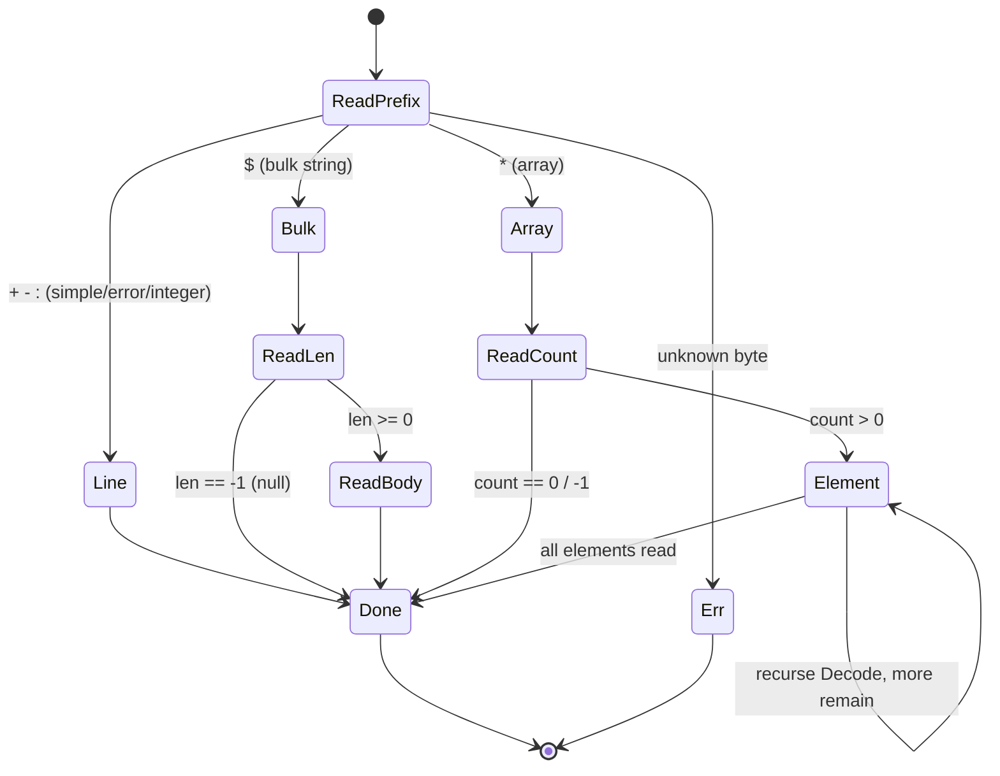
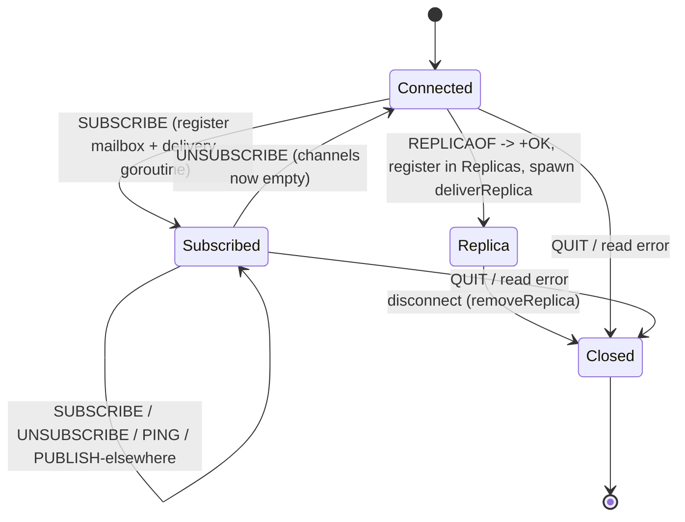
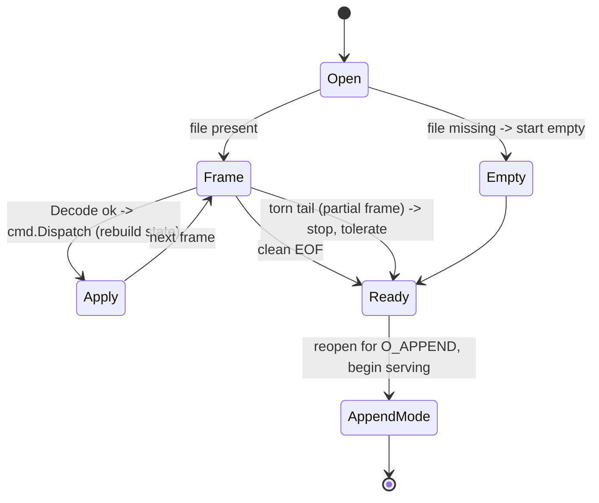

# mini-redis-go — Low-Level Design (LLD)

Module structure, state machines, concurrency model, and memory layout. For the
high-level view (system diagram, failure modes) see `ARCHITECTURE.md`; for sizing
see `CAPACITY.md`. Diagrams are Mermaid.

---

## 1. Module tree — one-line responsibility per package

```
cmd/server/            Process entrypoint: parse flags, build the DB + Server, run it.
internal/protocol/     RESP2 wire format — Decode, Encode, and the Value model.
internal/db/           The in-memory keyspace: 32-shard store, typed Entry, expiry,
                       Snapshot (for AOF rewrite), and the Pub/Sub Broker.
internal/cmd/          Command handlers + the dispatch registry (name -> handler ->
                       Value) and IsWrite classification. Handlers never touch sockets.
internal/persistence/  AOF: Append/Flush/fsync-policy (aof.go), Replay (replay.go),
                       and rewrite/compaction (rewrite.go).
internal/replication/  Primary side: Replicas registry, Propagate, heartbeat
                       (primary.go). Replica side: RunReplica client loop (replica.go).
internal/server/       TCP accept loop + per-connection serve, apply() write ordering,
                       connection-level SUBSCRIBE/UNSUBSCRIBE/REPLICAOF, lifecycle
                       goroutines, graceful shutdown.
internal/metrics/      Empty stub — scaffolded, not implemented.
tests/integration/     Black-box tests driven by the upstream go-redis/v9 client.
```

Dependency direction is one-way: `server` → {`cmd`, `persistence`, `replication`,
`protocol`, `db`}; `cmd` → {`db`, `protocol`}; `db` and `protocol` depend on
nothing internal. No import cycles.

---

## 2. Key state machines

### 2a. RESP parser (`protocol.Decode`)

Recursive descent over a `bufio.Reader`, dispatched on the first byte (the RESP
type tag). Arrays recurse into `Decode` per element. Two terminal errors: an
unknown type byte, and an unexpected EOF mid-frame (a torn/partial frame).



### 2b. Connection mode (Connected → Subscribed → Replica)

A connection starts in normal mode. `SUBSCRIBE` moves it to **Subscribed** (a
restricted command set — only SUBSCRIBE/UNSUBSCRIBE/PING/QUIT) and back once the
last channel is dropped. `REPLICAOF` moves it to **Replica**: the socket becomes a
one-way write feed and never returns to serving client commands. `QUIT` (or a
read error) tears any state down. These transitions are handled in
`server.serve` directly, *not* via `cmd.Dispatch`, because they act on the
connection, not the keyspace.



Distinct but related: a **server** started with `--replicaof` refuses *client*
writes with `-READONLY` — that's a server-role gate in `serve`, orthogonal to the
per-connection mode above.

### 2c. AOF replay (startup, before serving)

On boot, before the listener opens, the server replays the log to rebuild state,
then opens the same file for appending. A missing file is an empty start; a torn
trailing frame (crash mid-write) stops replay cleanly instead of erroring.



---

## 3. Concurrency model

One process, one shared `db.DB`, and a handful of goroutine *roles*. Each role
below scales on a different axis, which is why they don't contend.

| Goroutine role | Count | Bounded queue | Purpose |
|---|---|---|---|
| accept loop | 1 | — | accept TCP conns, spawn a handler each |
| connection handler | 1 per client | — | decode → apply → encode for that socket |
| per-replica streamer (`deliverReplica`) | 1 per replica | `chan []byte`, 256 | drain queued frames to the replica socket |
| per-subscriber delivery (`deliver`) | 1 per subscribed conn | `chan Message`, 256 | drain pub/sub mailbox to the socket |
| active-expiry reaper (`RunActiveExpiry`) | 1 | — | sample+evict expired keys every 100 ms |
| AOF `everysec` fsync ticker (`syncEverySec`) | 1 | — | fsync the AOF once a second |
| AOF compactor | 1 | — | check once/sec, rewrite when the log doubles past 64 KiB |
| replica heartbeat (`runReplicaHeartbeat`) | 1 (primary) | — | PING every replica every 5 s |
| mirror loop (`RunReplica`) | 1 (replica only) | — | stream primary writes → `cmd.Dispatch` |

**32-shard keyspace, per-shard mutex.** The keyspace is `[32]shard`, each a
`map[string]*Entry` under its own `sync.RWMutex`; a key routes to
`FNV-1a(key) % 32`. Two operations on keys in different shards take different
locks and run fully in parallel — so throughput scales with cores until two hot
keys happen to collide on one shard. Reads take `RLock` (many concurrent
readers); writes take `Lock`.

**The write ordering lock (`writeMu`) is a mutex, not a goroutine.** *(Note: the
Day-2 brief calls this a "single-writer AOF goroutine" — that's the documented
**upgrade path**, not the current code.)* Today, the connection handler itself
holds `writeMu` inline across the trio *{dispatch the write, append to the AOF,
Propagate to replicas}*, so the one append-only log's order matches the store's.
Crucially it is taken **only on the write path and only when an AOF or a replica
is attached** — reads never take it, and writes with persistence *and*
replication both off skip it entirely and parallelise freely across shards. The
only genuinely dedicated AOF background goroutine is the `everysec` fsync ticker.
The upgrade (per-write enqueue under the shard lock feeding one log-writer
goroutine) would let AOF-on writes parallelise too; it's deliberately unbuilt.

**Per-replica / per-subscriber streaming goroutines** each own a **bounded**
buffered channel (cap 256). The write path does a *non-blocking* enqueue and
**drops+logs** on overflow, so one slow replica or subscriber can never stall the
writer or any other consumer. That's what makes each stream independent: the
producer never blocks on a consumer's socket.

**Why each scales independently:** shards parallelise the keyspace across cores;
the per-consumer goroutines isolate slow sockets behind bounded queues; and
`writeMu` — the single serialization point — is bypassed on the read path and on
the no-durability/no-replication write path, so it only ever bottlenecks the
exact case that *needs* a total order (one ordered log/stream).

---

## 4. Memory layout

**Per-key fixed overhead.** Every key, whatever its type, points at one heap
`Entry`. `unsafe.Sizeof(Entry{})` is **96 bytes** on 64-bit — because `Entry`
inlines a slot for *all four* value types (a size-for-simplicity trade-off; a
tagged union or `any` would shrink it):

| `Entry` field | Bytes |
|---|---|
| `kind` (uint8, +7 padding) | 8 |
| `str []byte` (header) | 24 |
| `list [][]byte` (header) | 24 |
| `hash map[...]` (pointer) | 8 |
| `set map[...]` (pointer) | 8 |
| `expireAt time.Time` | 24 |
| **total** | **96** |

Plus the map machinery per entry: the value slot (`*Entry`, 8 B) + the key slot
(`string` header, 16 B) + amortized bucket/tophash + load-factor slack (~16 B) ≈
**~40 B**. So fixed overhead is **~136 bytes/key** *before* the key name and value
bytes.

**Per-value cost** is the payload backing array (rounded up to a Go size class),
separate from the 96-byte `Entry`.

**The 1M-keys model.** For 1,000,000 string keys, ~16-byte key names, 200-byte
values:

```
values     : 200 B × 1M  = 200 MB   (payload)
Entry structs: 96 B × 1M  =  96 MB   (fixed)
map + slots : ~40 B × 1M  =  40 MB   (fixed)
key names   :  16 B × 1M  =  16 MB
                            -------
                            ~352 MB
```

The Day-2 brief's textbook estimate — ~80 B overhead + 200 B value ≈ **~270 MB**
— assumes a slimmer entry. This implementation lands at **~350 MB** for the same
workload; the extra ~80 MB is the fat 96-byte `Entry` (four inline type slots)
plus real Go map overhead. Slimming `Entry` toward the ~270 MB figure is the
documented upgrade path. And with **no `maxmemory` eviction** (see
`ARCHITECTURE.md` §5), this number is a *floor*, not a cap — only TTLs and manual
sizing bound it.
